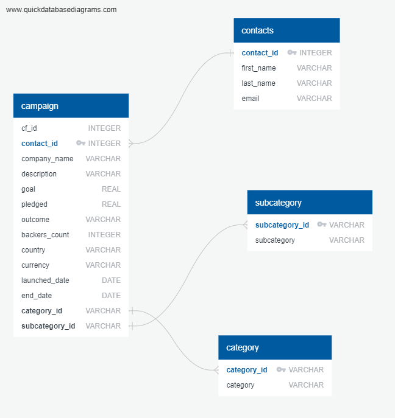

# Crowdfunding_ETL

## Project Overview
Crowdfunding_ETL is an Extract, Transform, Load (ETL) pipeline developed to process and manage crowdfunding campaign data. The project uses Python, Pandas, and SQL to extract data from raw Excel files, transform it into structured formats, and load it into a PostgreSQL database for analysis and reporting. This project simulates real-world data engineering tasks and demonstrates proficiency in data extraction, transformation, and loading, as well as database schema design.

 **Technologies used**: 
 1. Python (Pandas, Regular Expressions)
 2. Jupyter Notebooks
 3. PostgreSQL
 4. Git & GitHub
 5. Excel for raw data storage in .xlsx format

## ETL Pipeline Details

**Data Extraction**:
Data is extracted from two Excel files: crowdfunding.xlsx and contacts.xlsx.
The data includes crowdfunding campaign details and contact information for campaign organizers.

**Data Transformation**:

Extracted data is transformed into the following DataFrames:
1. Category DataFrame: Contains unique category_id and category names.
2. Subcategory DataFrame: Contains unique subcategory_id and subcategory names.
3. Campaign DataFrame: Contains detailed campaign information such as goals, outcomes, and funding status.
4. Contacts DataFrame: Splits contact details into first_name, last_name, and email columns.
All DataFrames are exported to CSV files for loading into the database.

**Data Loading**:
The transformed CSV files are loaded into a PostgreSQL database.
A database schema is created using SQL to define table structures, relationships, and constraints.
The database schema includes primary and foreign keys for referential integrity.

 **Database Schema**: 
The relational database schema includes the following tables:

1. categories: Stores unique category IDs and names.
2. subcategories: Stores unique subcategory IDs and names.
3. campaigns: Contains detailed campaign information, including foreign keys to categories and subcategories.
4. contacts: Stores contact information split into first and last names, with unique contact IDs.
5. The Entity-Relationship Diagram (ERD) defines the relationships between these tables to ensure data normalization and efficient querying.

## Installation & Setup
To set up this project on your local machine:

1. Clone the repository:
git clone https://github.com/your-username/Crowdfunding_ETL.git

2. Install the required python libraries
3. Set up PostgreSQL and create the database:
Create a PostgreSQL database named crowdfunding_db. Then run the crowdfunding_db_schema.sql script to create the tables.
4. Load the data into the PostgreSQL tables using the CSV files:
Use the COPY command or equivalent to load each CSV file into its corresponding table.

## Usage
Run the Jupyter notebook ETL_Mini_Project.ipynb to execute the ETL pipeline.
The final processed data will be loaded into PostgreSQL tables for querying and analysis.
